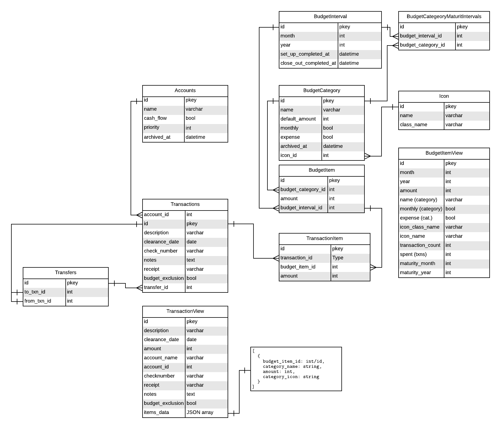

Budget API
==========

## Resources
* Accounts
* Transactions
* Budget::Categories
* Budget::Items
* Budget::Intervals
* Budget::CategoryMaturityIntervals
* Transfers
* Icons

## Endpoints
### Accounts

| HTTP Verb       | Endpoint                        | Expected return                      |
| --------------- | -----------------               | ------------------------------------ |
| GET (index)     | /accounts                       | all active (not scoped accounts)     |
| GET (show)      | /accounts/:id                   | 200 + resource / 404                 |
| POST            | /accounts                       | 201 + resource / 404, 422            |
| PUT             | /accounts/:id                   | 200 + resource / 404, 422            |
| DELETE          | /accounts/:id                   | 200 / 404, 422                       |

### Transactions

| HTTP Verb     | Endpoint                            | Expected return                     |
| ------------- | ---------------------------         | ----------------                    |
| GET (index)   | /accounts/:id/transactions          | collection of transaction resources |
| GET           | /accounts/:id/transactions/metadata | metadata                            |
| GET (show)    | /accounts/:id/transactions/:id      | 200 + resource / 404                |
| POST          | /accounts/:id/                      | 201 + resource / 404, 422           |
| PUT           | /accounts/:id/transactions/:id      | 200 + resource / 404, 422           |
| DELETE        | /accounts/:id/transactions/:id      | 204 / 404, 422                      |

### Budget
#### Categories
| HTTP Verb   | Endpoint               | Expected return           |
| ---------   | --------               | ---------------           |
| GET (index) | /budget/categories     | all active catgories      |
| POST        | /budget/categories     | 201 + resource / 404, 422 |
| PUT         | /budget/categories/:id | 200 + resource / 404, 422 |
| DELETE      | /budget/categories/:id | 204 / 404, 422            |

#### Items
| HTTP Verb   | Endpoint                                               | Expected return                     |
| ---------   | --------                                               | ---------------                     |
| GET (index) | /budget/items                                          | collection of budget item resources |
| GET         | /budget/items/metatdata                                | metadata                            |
| POST        | /budget/categories/:category_id/items                  | 201 + resource / 404, 422           |
| GET         | /budget/categories/:category_id/items/:id              | 200 + resource / 404                |
| PUT         | /budget/categories/:category_id/items/:id              | 200 + resource / 404, 422           |
| DELETE      | /budget/categories/:category_id/items/:id              | 204 / 404, 422                      |
| GET         | /budget/categories/:category_id/items/:id/transactions | transactions collection             |

#### Discretionary
| HTTP Verb | Endpoint                           | Expected return                                          |
| --------- | --------                           | ---------------                                          |
| GET       | /budget/discretionary/transactions | collection of discretionary transactions for given month |

### Transfers
| HTTP Verb   | Endpoint       | Expected return                        |
| ---------   | --------       | ---------------                        |
| GET (index) | /transfers     | collection of transfers, plus metadata |
| POST        | /transfers     | 201 + resource / 404, 422              |
| DELETE      | /transfers/:id | 200 / 404, 422                         |

### Icons
| HTTP Verb   | Endpoint   | Expected return           |
| ---------   | --------   | ---------------           |
| GET (index) | /icons     | collection of icons       |
| GET (show)  | /icons/:id | 200 + resource / 404, 422 |
| POST        | /icons     | 201 + resource / 404, 422 |
| PUT         | /icons/:id | 200 + resource / 404, 422 |
| DELETE      | /icons/:id | 204 / 404, 422            |

### Budget Category Maturity Intervals
| HTTP Verb    | Endpoint                                                 | Expexted return                  |
| --------     | --------                                                 | ---------------                  |
| GET (index)  | /budget/categories/:catgory_id/maturity_intervals        | collection of maturity intervals |
| POST         | /budget/categories/#{category.id}/maturity_intervals     | 201 + resource / 404, 422        |
| PUT          | /budget/categories/#{category.id}/maturity_intervals/:id | 200 + resource / 404, 422        |
| DELETE       | /budget/categories/#{category.id}/maturity_intervals/:id | 204 / 404, 422                   |

### Intervals
| HTTP Verb | Endpoint               | Expected return |
| --------- | ---------------------- | --------------- |
| PUT       | /interval/:month/:year | 200 + resource  |

## ERD


## JSON Representations
### Accounts

#### Index
```
[
    {
        "id": 1,
        "name": "Checking",
        "cash_flow": true,
        "priority": 1,
        "archived_at": null,
        "created_at": "2019-01-02T23:59:28.473Z",
        "updated_at": "2019-02-22T05:49:22.399Z",
        "balance": 77126
    },
    ...
]
```

#### Show
```
  {
      "id": 1,
      "name": "Checking",
      "cash_flow": true,
      "priority": 1,
      "archived_at": null,
      "created_at": "2019-01-02T23:59:28.473Z",
      "updated_at": "2019-02-22T05:49:22.399Z",
      "balance": 77126
  }
```

### Transactions
#### Index

```
{
  "metadata": {
    "date_range": [
      "2019-03-01",
      "2019-03-31"
      ],
    "prior_balance": 30784,
    "query_options": {
     "account_id": "1",
     "include_pending": true
    }
  },

  "transactions": [
    {
      "id": 12,
      "description": "",
      "budget_category": null,
      "icon_class_name": null,
      "budget_item_id": null,
      "clearance_date": null,
      "amount": 19,
      "account_name": "Checking",
      "account_id": 1,
      "check_number": null,
      "receipt": null,
      "notes": "",
      "budget_exclusion": false,
      "subtransactions": [
        {
          "id": 13,
          "budget_category": "Pets",
          "budget_item_id": 3,
          "description": "",
          "amount": 9,
          "primary_transaction_id": 12,
          "icon_class_name": null
        },
        {
          "id": 14,
          "budget_category": "Grocery",
          "budget_item_id": 2,
          "description": "",
          "amount": 10,
          "primary_transaction_id": 12,
          "icon_class_name": null
        }
      ],
      "updated_at": "2019-01-14T02:47:34.167Z"
    },
    ...
  ]
}
```

#### Resource
This resource will be returned after PUT and POST requests

```
{
  "id": 65,
  "description": "Black Pearl",
  "budget_category": null,
  "icon_class_name": null,
  "budget_item_id": null,
  "clearance_date": null,
  "amount": -2000,
  "account_name": "Checking",
  "account_id": 1,
  "check_number": null,
  "receipt": null,
  "notes": null,
  "budget_exclusion": false,
  "subtransactions": [],
  "updated_at": "2019-03-03T03:00:00.903Z"
}
```

This version will be returned for the show route
```
{
  "id": 9446,
  "description": "",
  "amount": -800,
  "clearance_date": "2019-10-11",
  "check_number": null,
  "account_id": 17,
  "budget_item_id": 2929,
  "primary_transaction_id": 9445,
  "notes": null,
  "receipt": null,
  "budget_exclusion": false,
  "transfer_id": null,
  "created_at": "2019-10-13T19:22:57.882Z",
  "updated_at": "2019-10-13T19:22:57.882Z",
  "account_name": "Aspiration (ck)"
}
```

### Budget
#### Categories

##### Index
```
[
  {
    "id": 2,
    "accrual": true,
    "name": "Grocery",
    "expense": true,
    "monthly": false,
    "default_amount": -10000,
    "icon_id": null,
    "icon_class_name": null
  },
]
```

##### Resource
```
{
  "id": 2,
  "name": "Grocery",
  "expense": true,
  "monthly": false,
  "default_amount": -10000,
  "icon_id": null,
  "icon_class_name": null
}
```
There is no show route per se, but this resource will be returned after PUT and POST requests

#### Items
##### Index
```
{
  "metadata": {
    "spent": 68417,
    "balance": 108818,
    "days_remaining": 30,
    "total_days": 31,
    "month": 3,
    "year": 2019
    "is_set_up": true,
    "is_closed_out": false,
  },
  "collection": [
    {
      "id": 26,
      "month": 3,
      "year": 2019,
      "accrual": false,
      "amount": -9000,
      "budget_category_id": 12,
      "budget_interval_id": 22,
      "created_at": "2019-02-15T03:48:47.289Z",
      "updated_at": "2019-02-15T03:48:47.289Z",
      "name": "gas",
      "expense": true,
      "monthly": false,
      "icon_class_name": null,
      "icon_name": null,
      "transaction_count": 0,
      "spent": 0
    }
  ]
}
```

##### Resource
A full version of the resource is returned after POST or PUT requests
```
{
  "id": 26,
  "month": 3,
  "year": 2019,
  "accrual": false,
  "amount": -9000,
  "budget_category_id": 12,
  "budget_interval_id": 22,
  "created_at": "2019-02-15T03:48:47.289Z",
  "updated_at": "2019-02-15T03:48:47.289Z",
  "name": "gas",
  "expense": true,
  "monthly": false,
  "icon_class_name": null,
  "icon_name": null,
  "transaction_count": 0,
  "spent": 0
}
```

##### Transactions
Get a simplified set of transactions for a budget item
```
[
  {
    "id": 3,
    "description": "Costco",
    "amount": -900,
    "clearance_date": "2019-01-02",
    "check_number": null,
    "account_id": 1,
    "budget_item_id": 3,
    "primary_transaction_id": 2,
    "notes": null,
    "receipt": null,
    "budget_exclusion": false,
    "transfer_id": null,
    "created_at": "2019-01-03T20:35:46.464Z",
    "updated_at": "2019-01-03T20:35:46.464Z",
    "account_name": "Checking"
  },
  ...
]
```

### Transfers

##### Resource
```
{
  "id": 1,
  "to_transaction_id": 2,
  "from_transaction_id": 1,
  "created_at": "2019-03-20T04: 59: 57.953Z",
  "updated_at": "2019-03-20T04: 59: 57.953Z",
  "to_transaction": {
    "id": 2,
    "description": "Transfer to 33rd City Bank",
    "budget_category": null,
    "icon_class_name": null,
    "budget_item_id": null,
    "clearance_date": null,
    "amount": 279,
    "account_name": "33rd City Bank",
    "account_id": 1,
    "check_number": null,
    "receipt": null,
    "notes": null,
    "budget_exclusion": false,
    "subtransactions": [],
    "updated_at": "2019-03-20T04: 59: 57.960Z"
  },
  "from_transaction": {
    "id": 1,
    "description": "Transfer to 33rd City Bank",
    "budget_category": null,
    "icon_class_name": null,
    "budget_item_id": null,
    "clearance_date": null,
    "amount": -279,
    "account_name": "34th City Bank",
    "account_id": 2,
    "check_number": null,
    "receipt": null,
    "notes": null,
    "budget_exclusion": false,
    "subtransactions": [],
    "updated_at": "2019-03-20T04: 59: 57.969Z"
  }
}
```

##### Index
```
{
  "metadata": {
    "limit": 10,
    "offset": 0,
    "viewing": [
        1,
        1
    ],
    "total": 1
  },
  "transfers": [
    {
      "id": 1,
      "to_transaction_id": 67,
      "from_transaction_id": 66,
      "created_at": "2019-03-03T03:22:45.333Z",
      "updated_at": "2019-03-03T03:22:45.333Z",
      "to_transaction": {
        "id": 67,
        "description": "Transfer to 12th tn",
        "budget_category": null,
        "icon_class_name": null,
        "budget_item_id": null,
        "clearance_date": null,
        "amount": 2000,
        "account_name": "12th tn",
        "account_id": 21,
        "check_number": null,
        "receipt": null,
        "notes": null,
        "budget_exclusion": false,
        "subtransactions": [],
        "updated_at": "2019-03-03T03:22:45.369Z"
      },
      "from_transaction": {
        "id": 66,
        "description": "Transfer to 12th tn",
        "budget_category": null,
        "icon_class_name": null,
        "budget_item_id": null,
        "clearance_date": null,
        "amount": -2000,
        "account_name": "Checking",
        "account_id": 1,
        "check_number": null,
        "receipt": null,
        "notes": null,
        "budget_exclusion": false,
        "subtransactions": [],
        "updated_at": "2019-03-03T03:22:45.377Z"
      }
    }
  ]
}
```

### Budget Category Maturity Intervals
#### Resource
```
{
  id: 1,
  category_id: 44,
  month: 12,
  year: 2022
}
```

### Icons
##### Index
```
[
  {
    "id": 1,
    "class_name": "fas fa-beer",
    "name": "Beer"
  },
]
```

##### Resource
```
{
  "id": 8,
  "class_name": "fas fa-subway",
  "name": "Subway"
}
```

## How it all works
### Accounts
Accounts are mostly self explanitory. This can be a regular checking account, savings, credit card etc.
There is a boolean column called `cash_flow`. This flag is set to true for things that are typcially used for daily expenses.
This flag should be set false for accounts that you expect to maintain a constant balance or you
want to budget for the change (ie a savings account you want to grow or a credit card you are trying to pay down). So, even
if you like to use your credit card for daily stuff and you religiously pay it off this would be a non-cashflow account.

### Budget Categories
Budget Categories are types of expenses and revenues. They are also categorized as weekly and monthly which provide for
a nice grouping. The default amount is a nice to have for things that stay the same or for things that are divided up
over several months. An accrual is a category that is not expected each interval. See items for more information.

### Budget Items
Budget Items are a month's instance of a budget category. They can have whatever amount (as longer expenses are <= 0 and
revenues are >= 0) is needed. Weekly and monthly can have different rules for how they are treated and how they are used
to determine information about the state of the budget. This app certainly hints at how that could be done but is not
prescriptive. When returning a collection a SQL view is used to return all data on the record plus additional information:
`name`, `monthly` and `weekly` come from the parent category, `icon_name` and `icon_class_name` come from the Icon (through
Category), `transaction_count` is a count query of related transactions, `spent` is a sum total on related transactions.

### Transaction
This concept ties together the other concept described. A transaction belongs to an account (required) and belongs to
a budget item (optional).

#### Primary Transaction
Most transactions will fall into this bucket. `amount` is required (unless there are subtransactions). `budget_item_id` is
not required but not allowed if there are subtransactions.

#### Subtransactions
Sometimes you might spend money that is a single transaction that does not map perfectly to a budget item. A subtransaction
lives in the transactions table and maps nicely to a budget item. `amount` is required and things like `account` and
`clearance_date` are updated from the parent through callbacks

#### View
A SQL view is used return all the data on the record plus additional info: `budget_category` is the name of a `BudgetCategory`
(through `budget_item`), `icon_class_name` comes from `Icon` (though `BudgetCategory`), `amount` is the `amount` OR the sum of
any subtransactions, `account_name` comes from the parent `Account`. Subtransactions are a JSON array that includes: its `id`,
its `budget_category` (name), its `budget_item_id`, its `description`, its `amount` and its `icon_class_name`.

#### Budget Exclusion
This option is available for transactions of non-cashflow accounts. This would be used for a transaction that will change
the balance of an account that will not impact the budget. This type of transaction can be used in pairs where one transaction,
which is not an exclusion is tied to a budget item (savings for example) and this transaction is a debit from one account
and the deposit into savings which is then a budget exclusion. These are also excluded from the discretionary transactions.

### Transfers
Moving money from one place to another. There is a restrictions against changing amounts when a transaction is tied to a
transfer. They also cannot have a budget_item associated. These will not appear in discretionary transactions either.
